

	

		

			<h3 class="banner-title">Impact of concrete pavements on the urban heat island</h3>
			
Master's Thesis, 2015

			<a href="http://hdl.handle.net/2142/88095" target="_blank" class="banner-button"><i class="fa fa-cloud-download" aria-hidden="true"></i> Download PDF</a>
		
<!--col-md-3-->
	
<!--row-->

<!--container-->

Reviewer For: [International Journal of Pavement Engineering](http://www.tandfonline.com/loi/gpav20), [Journal of Solar Energy](https://www.journals.elsevier.com/solar-energy/), [Journal of Cleaner Production](https://www.journals.elsevier.com/journal-of-cleaner-production/), [International Journal for Heat and Mass Transfer](https://www.journals.elsevier.com/international-journal-of-heat-and-mass-transfer/), [Transportation Research Record: Journal of the Transportation Research Board](http://trrjournalonline.trb.org/loi/trr), [Environmental Research Letters](http://iopscience.iop.org/journal/1748-9326), [Sustainable Cities and Society](https://www.journals.elsevier.com/sustainable-cities-and-society), [Measurement](https://www.journals.elsevier.com/measurement)

### Peer-Reviewed Journal Articles

<table class="table table-striped table-hover">
	<tr>
		<td class="col-md-2">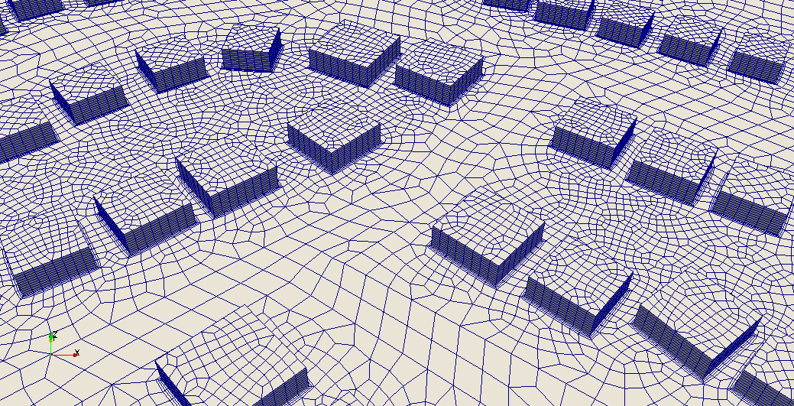</td>
		<td><b>Cool Pavement Strategies for Urban Heat Island Mitigation in Suburban Phoenix, Arizona</b>   <b>Sen, S.</b>, Roesler, J., Ruddell, B., and Middel, A.   Sustainability, Vol. 11, No. 16, 4452 (2019)   [<a href="https://www.mdpi.com/2071-1050/11/16/4452" target="_blank">pdf</a>]</td>
	</tr>
	<tr>
		<td class="col-md-2">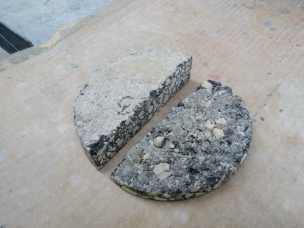</td>
		<td><b>Thermal and optical characterization of asphalt field cores for microscale urban heat island analysis</b>   <b>Sen, S.</b>, and Roesler, J.   Construction and Building Materials, Vol. 217, pp. 600-611 (2019)   [<a href="https://www.sciencedirect.com/science/article/pii/S0950061819312619" target="_blank">pdf</a>]</td>
	</tr>
	<tr>
		<td class="col-md-2"></td>
		<td><b>Use phase assessment of photocatalytic cool pavements</b>   Baral, A., <b>Sen, S.</b>, and Roesler, J.   Journal of Cleaner Production, Vol. 190, pp. 722-728 (2018)   [<a href="https://www.sciencedirect.com/science/article/pii/S095965261831182X" target="_blank">pdf</a>]</td>
	</tr>
	<tr>
		<td class="col-md-2">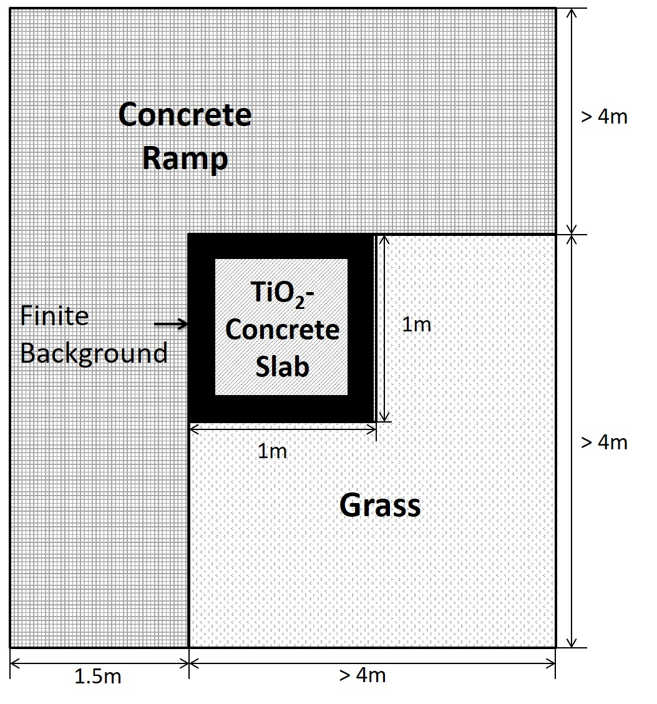</td>
		<td><b>Albedo estimation of finite-sized concrete specimens</b>   <b>Sen, S.</b>, Roesler, J., and King, D.   Journal of Testing and Evaluation, Vol. 47, No. 2, pp. - (2019)   [<a href="https://compass.astm.org/DIGITAL_LIBRARY/JOURNALS/TESTEVAL/PAGES/JTE20170059.htm" target="_blank">pdf</a>]</td>
	</tr>
	<tr>
		<td class="col-md-2">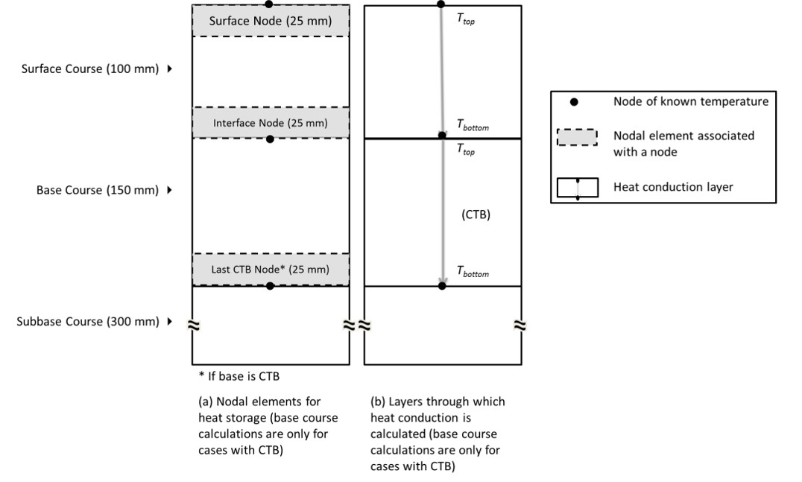</td>
		<td><b>Microscale heat island characterization of rigid pavements</b>   <b>Sen, S.</b>, and Roesler, J.   Transportation Research Record: Journal of the Transportation Research Board, No. 2639, pp. 73-83 (2017)   [<a href="http://trrjournalonline.trb.org/doi/10.3141/2639-10" target="_blank">pdf</a>]</td> 
	</tr>
	<tr>
		<td class="col-md-2">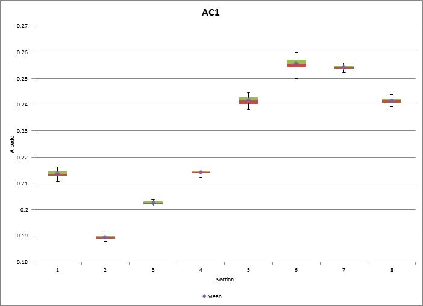</td>
		<td><b>Aging albedo model for asphalt pavements</b>   <b>Sen, S.</b>, and Roesler, J.   Journal of Cleaner Production, Vol. 117, pp. 169-175 (2016)   [<a href="http://www.sciencedirect.com/science/article/pii/S0959652616000378" target="_blank">pdf</a>]</td> 
	</tr>
	<tr>
		<td class="col-md-2">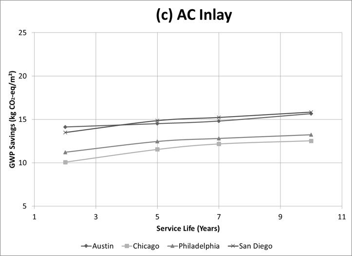</td>
		<td><b>Contextual heat island assessment for pavement preservation.</b>   <b>Sen, S.</b>, and Roesler, J.   International Journal of Pavement Engineering, Vol. 19, No. 10, pp. 865-873 (2018)   [<a href="http://www.tandfonline.com/doi/full/10.1080/10298436.2016.1213842" target="_blank">pdf</a>]</td> 
	</tr>
</table>

### Peer-Reviewed Conference Papers

<table class="table table-striped table-hover">
	<tr>
		<td class="col-md-2">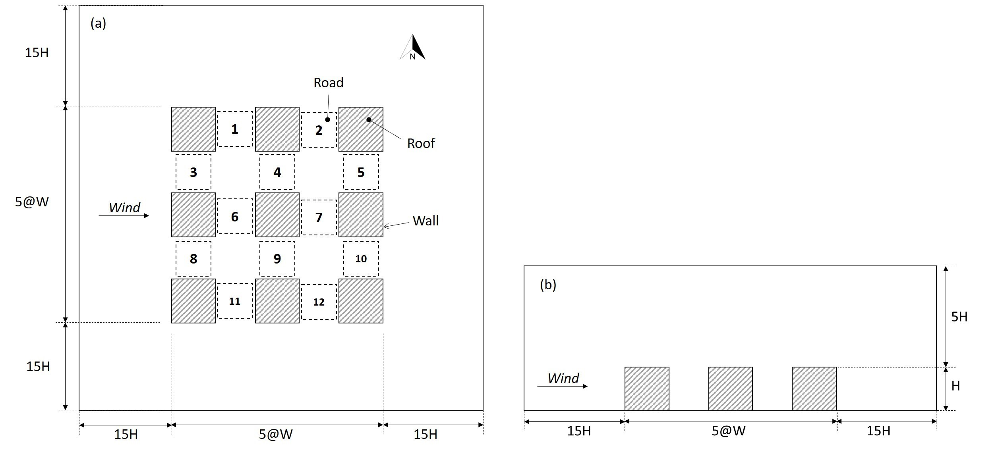</td>
		<td><b>Coupled pavement-urban canyon model for assessing cool pavements</b>   <b>Sen, S.</b>, and Roesler, J.   International Airfield and Highway Pavements Conference, Chicago, IL (2019) <i>Accepted, in press</i></td>
	</tr>
	<tr>
		<td class="col-md-2">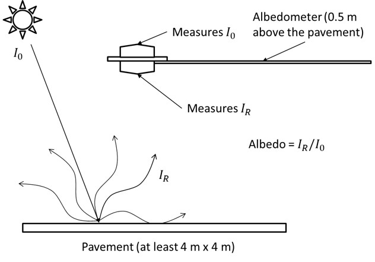</td>
		<td><b>Environmental design concept for multi-functional concrete overlays</b>   Baral, A., <b>Sen, S.</b>, and Roesler, J.   9th International DUT-Workshop on Research and Innovations for Design of Sustainable and Durable Concrete Pavements, Potsdam, Germany (2018) </td>
	</tr>
	<tr>
		<td class="col-md-2">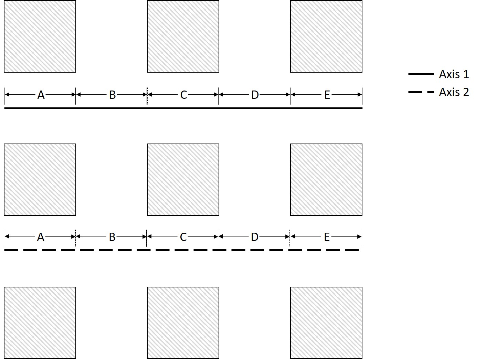</td>
		<td><b>Pavement geometry in microscale urban heat islands</b>   <b>Sen, S.</b>, and Roesler, J.   Conference of the Transportation Association of Canada, St. Johns, NL, Canada (2017)   [<a href="http://www.tac-atc.ca/sites/default/files/conf_papers/sens_-_pavement_geometry_in_microscale_urban_heat_islands.pdf" target="_blank">pdf</a>] </td>
	</tr>
	<tr>
		<td class="col-md-2">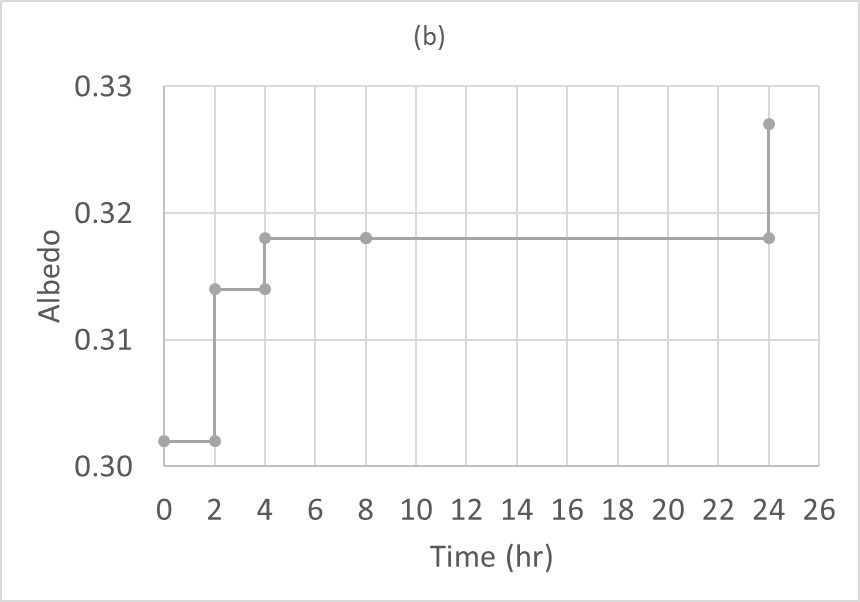</td>
		<td><b>Use-phase sustainability through preservation</b>   <b>Sen, S.</b>, Baral, A., and Roesler, J.   10th International Conference on Road and Airfeld Pavement Technology, Hong Kong (2017)</td>
	</tr>
	<tr>
		<td class="col-md-2">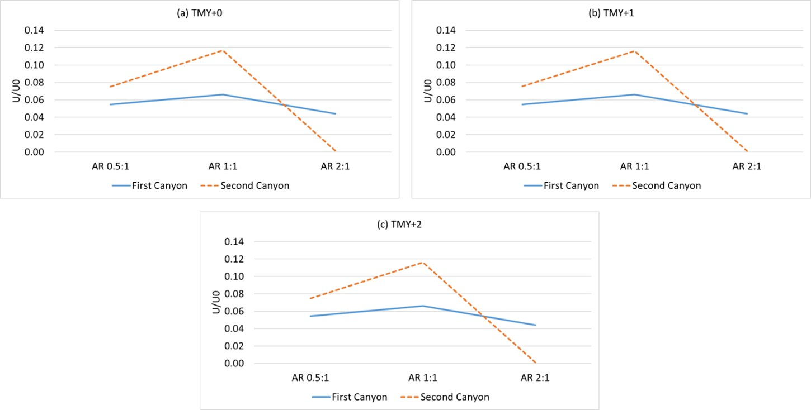</td>
		<td><b>An uncoupled pavement-urban canyon model for heat islands</b>   <b>Sen, S.</b>, and Roesler, J.   International Symposium on Pavement Life Cycle Assessment, Champaign, IL, ISBN 978-1-315-15932-4, pp. 111-120, (2017)   [<a href="https://www.taylorfrancis.com/books/9781351659222" target="_blank">pdf</a>] </td>
	</tr>
	<tr>
		<td class="col-md-2">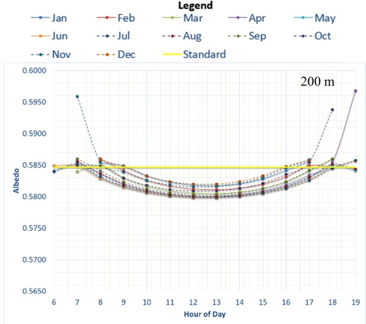</td>
		<td><b>Albedo as an engineering property of concrete pavements</b>   <b>Sen, S.</b>, and Roesler, J.   11th International Conference on Concrete Pavements, San Antonio, TX, ISBN 978-0-9860291-2-7, pp. 59-71 (2016)</td>
	</tr>
	<tr>
		<td class="col-md-2">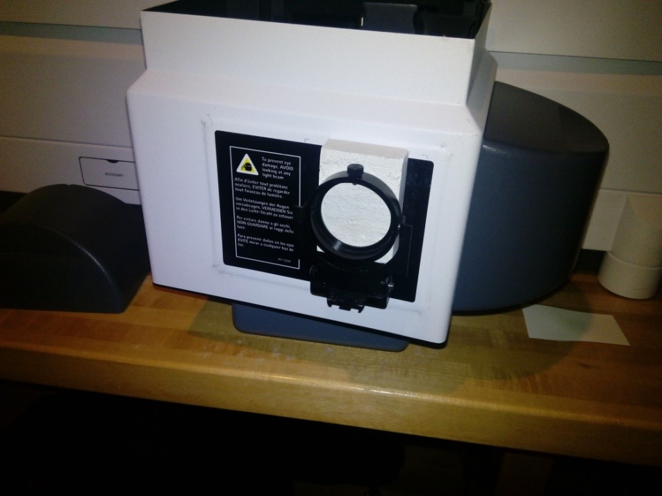</td>
		<td><b>Emissions reducing benefits of multi-functional photocatalytic concrete inlays</b>   King, D., Roesler, J., and <b>Sen, S.</b>   11th International Conference on Concrete Pavements, San Antonio, TX, ISBN 978-0-9860291-2-7, pp. 72-81 (2016)</td>
	</tr>
	<tr>
		<td class="col-md-2">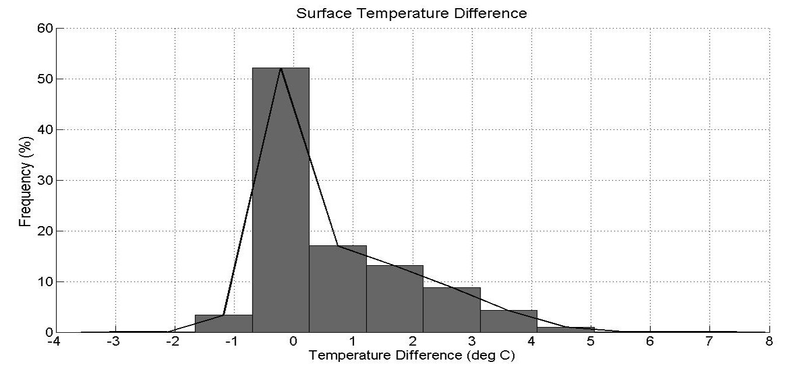</td>
		<td><b>Structural and Environmental Benefits of Concrete Inlays for Pavement Preservation</b>   <b>Sen, S.</b>, King, D., and Roesler, J.   Airfield and Highway Pavements 2015, Miami, FL, pp. 697-707 (2015)   [<a href="https://ascelibrary.org/doi/10.1061/9780784479216.062" target="_blank">pdf</a>] </td>
	</tr>
	<tr>
		<td class="col-md-2">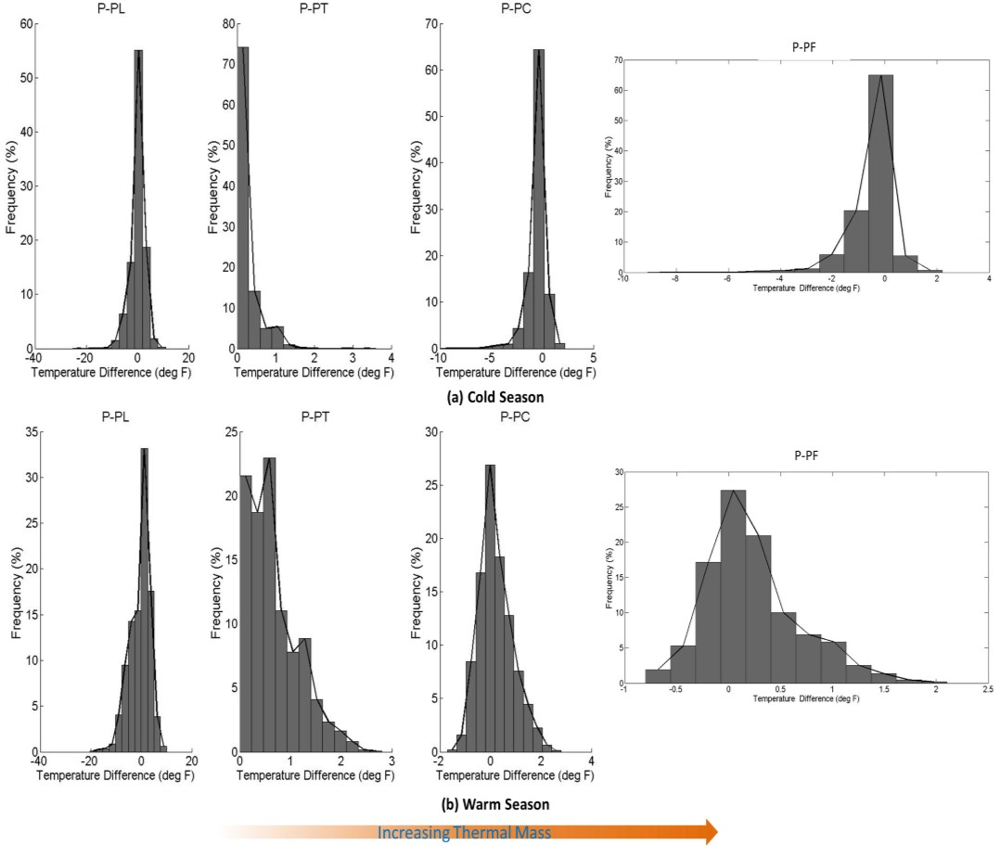</td>
		<td><b>Assessment of Concrete Pavement Structure on Urban Heat Island</b>   <b>Sen, S.</b>, and Roesler, J.   International Symposium on Pavement Life Cycle Assessment, Davis, CA, pp. 191-200 (2014)   [<a href="http://www.ucprc.ucdavis.edu/p-LCA2014/media/pdf/Papers/LCA14_Urban%20Heat%20Island.pdf" target="_blank">pdf</a>] </td>
	</tr>
</table>

